The Manager is a soccer simulator aiming to simulate tournaments, matchs, and clubs/players evolution, inspired by games such as Football Manager, FIFA Manager.

## Screenshots

### Menu

### Simulation configuration

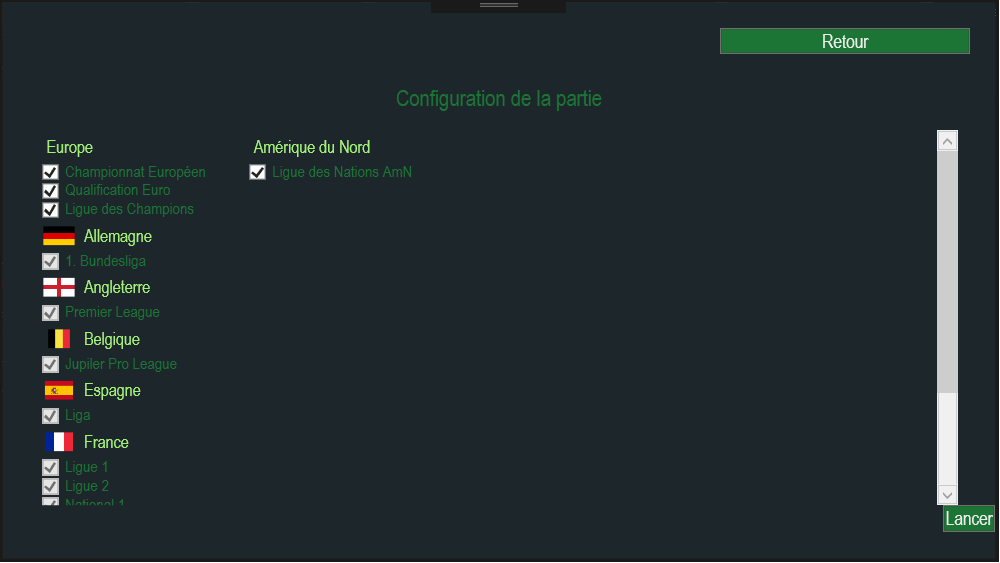 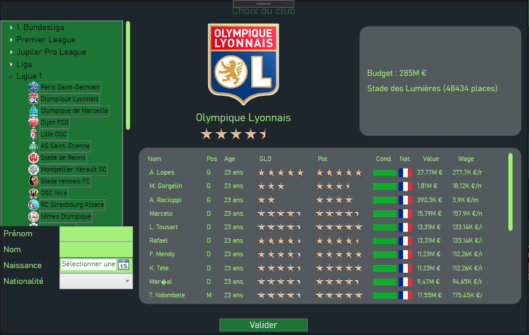 

### Tournaments screen

 

### Screens

	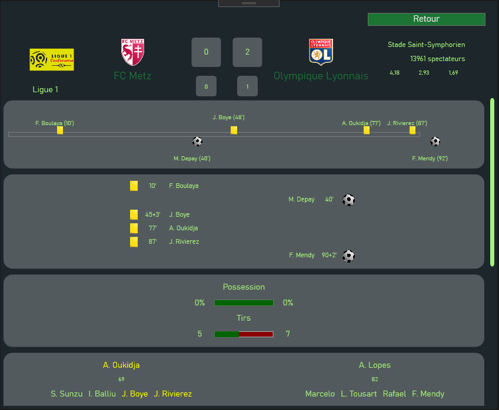 
	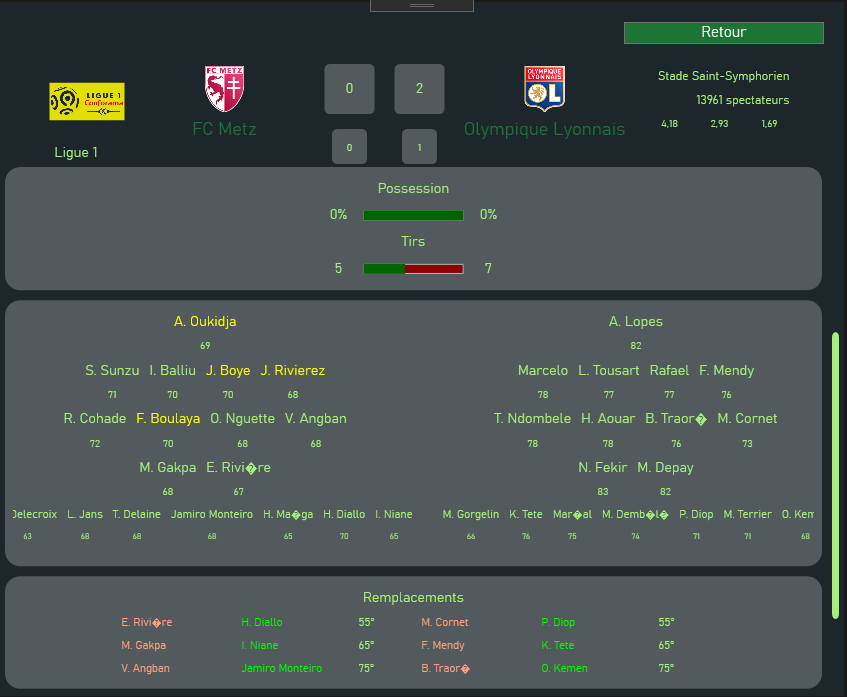

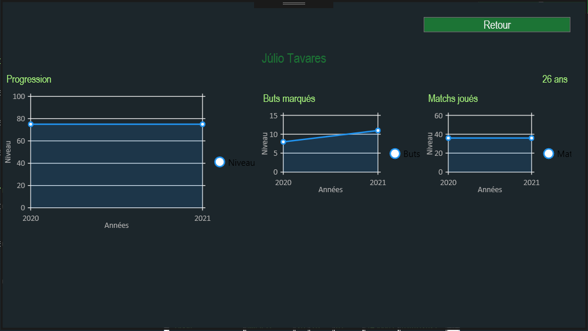 

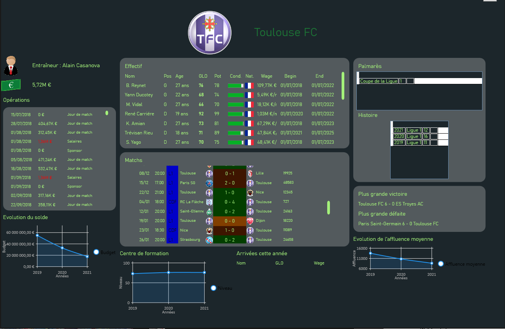

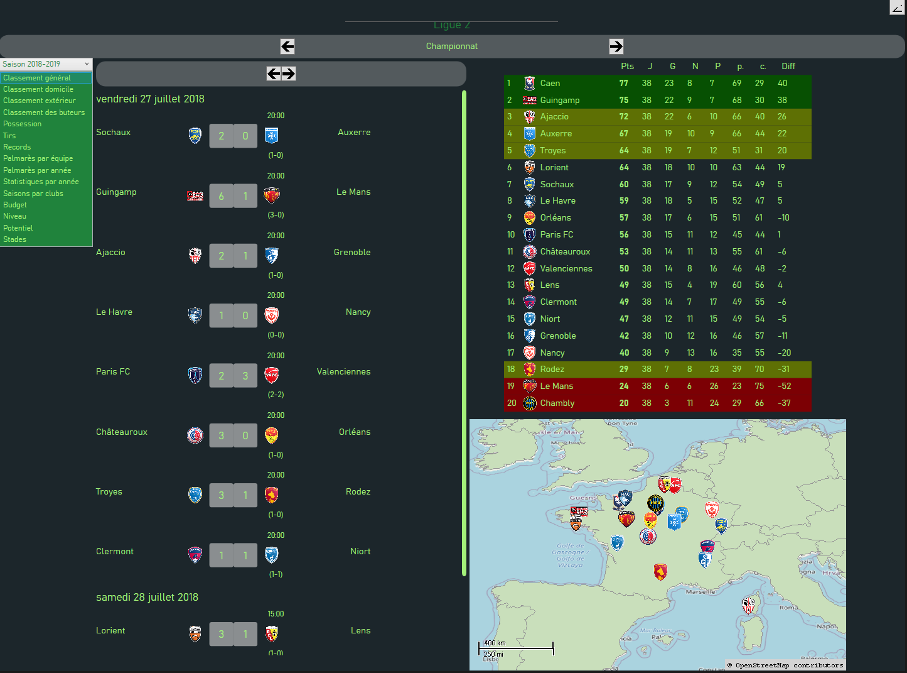

	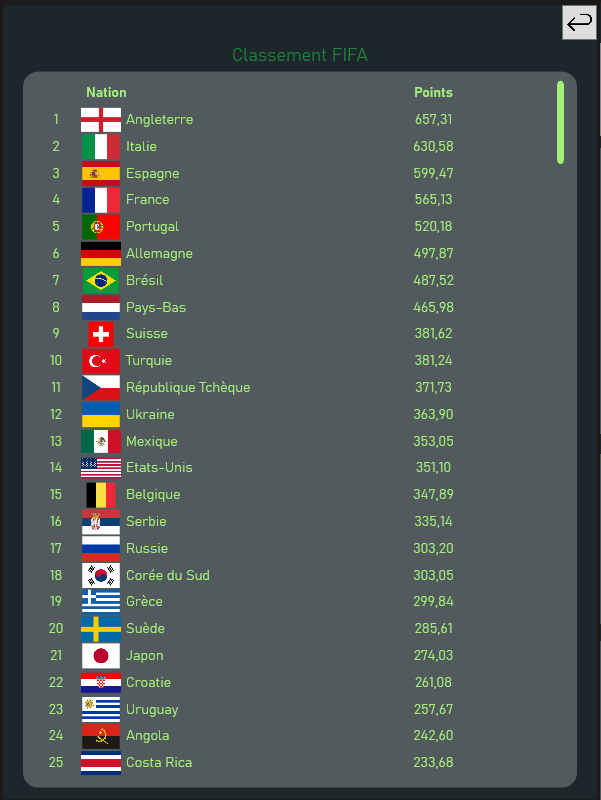
	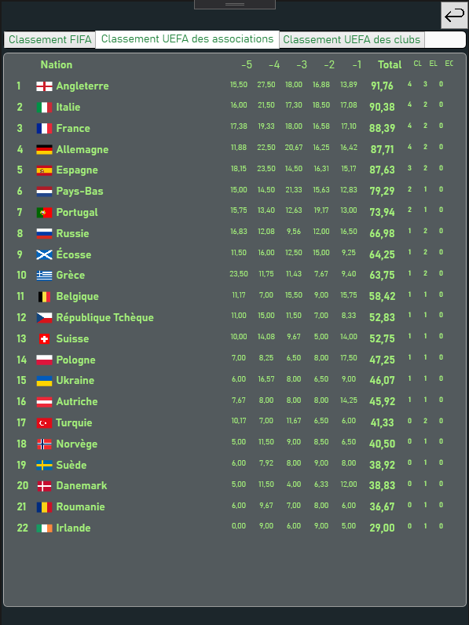

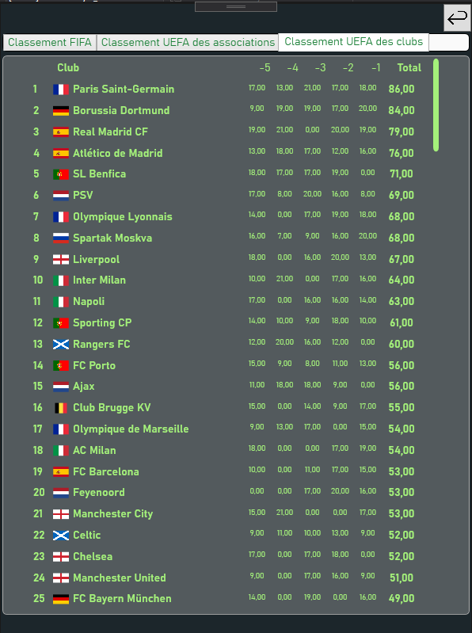

### Search players screen

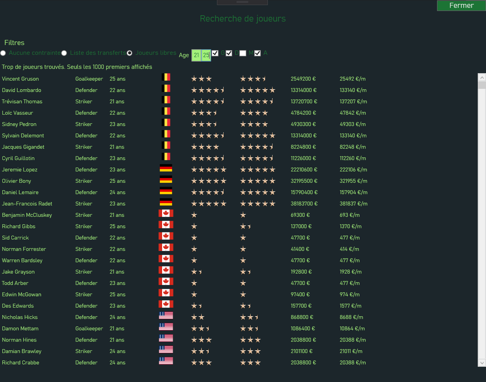

### Pre-match screen

### Live match screen

## Simulation stability

The simulation has gained in stability : money in game stabilizes after few years and remains stable after. Players and clubs average level tends to incrase over time.

Some realism issues : Small clubs at beginning can't stabilize in professionnals divisions

  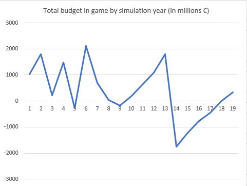
  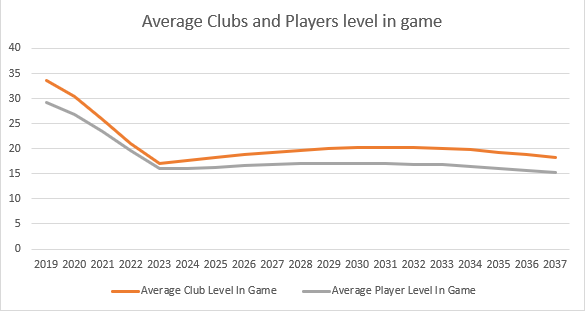

  
  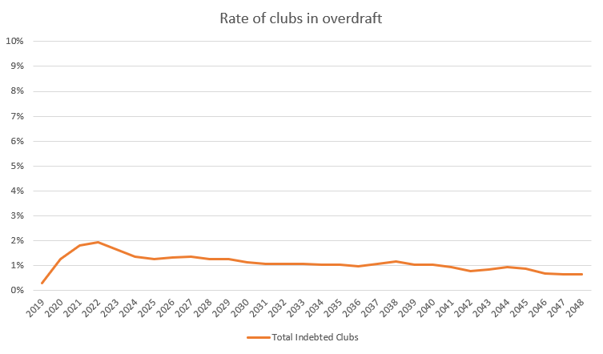

## Features

| Task                                                                  | Status           |
| --------------------------------------------------------------------- | ---------------- |
| **World**                                                             |                  |
| Tournaments rules                                                     | 🟢 OK           |
| Improve game stability                                                | 🟡 In progress  |
| Managers and staff                                                    | 🟡 In progress  |
| Transferts                                                            | 🟡 In progress  |
| **Game**                                                              |                 |
| Detailed game simulation                                              | 🔴 Not started  |
| Games in real-time                                                    | 🟡 In progress  |
| Players evolution                                                     | 🟡 In progress  |
| **Tournaments**                                                       |                 |
| Hierarchical Competitions (promotion, relegation ...)                 | 🟢 OK  |
| Automatically created domestic cup (qualifications and scheduling)    | 🟢 OK  |
| International tournaments                                 			| 🟢 OK  |
| International ranking                                 				| 🟢 OK  |
| Specials rules (lower team at home for domestic cups...)              | 🟢 OK  |
| **Club**                                                              |                 |
| Evolution of club facilities                                          | 🟡 In progress  |
| Financial control                                                     | 🔴 Not started  |
| **Managing**                                                          |                 |
| Staff management                                                      | 🔴 Not started |
| Youth team management                                                 | 🔴 Not started |
| Recruitment tasks                                                     | 🟡 In progress |
| **Miscellaneous**                                                     |				  |
| Simulation serialization				                                | 🟢 OK |
| Manage memory for long games                                          | 🔴 Not started |
| Improve serialization to manage large objects graph                   | 🔴 Not started |

## Authors
Nicolas Lépy

## Tools used
*   .NET Framework 4.8 and WPF
*   Visual Studio
*   Rider
*   Windows Media Player library
*   MapWindow GIS

## Credits

*   [Live Charts for WPF](https://www.google.com)
*   [MapWindow GIS](https://www.mapwindow.org/)
*   MathNet.Numerics
*   [pngtree.com](https://pngtree.com)
*   Data about cities were obtained from [SimpleMaps](https://simplemaps.com/data/world-cities)
*   Data about players and clubs were obtained from [Kaggle](https://www.kaggle.com/stefanoleone992/fifa-22-complete-player-dataset?select=players_22.csv)

## License

This project is licensed under the MIT License - see the [LICENSE.md](LICENSE.md) file for details
