The Manager is a soccer simulator aiming to simulate tournaments, matchs, and clubs/players evolution, inspired by games such as Football Manager, FIFA Manager.

## Screenshots

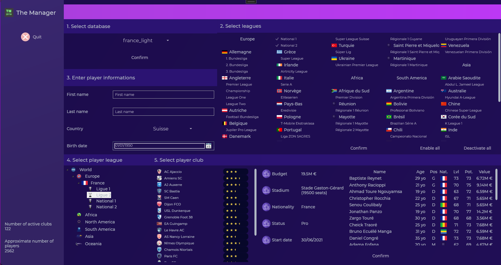 

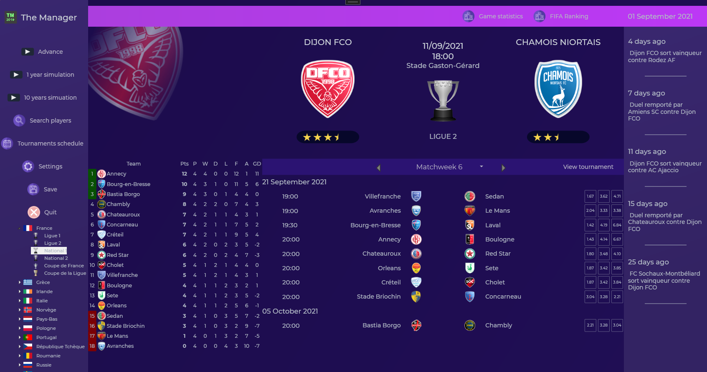 

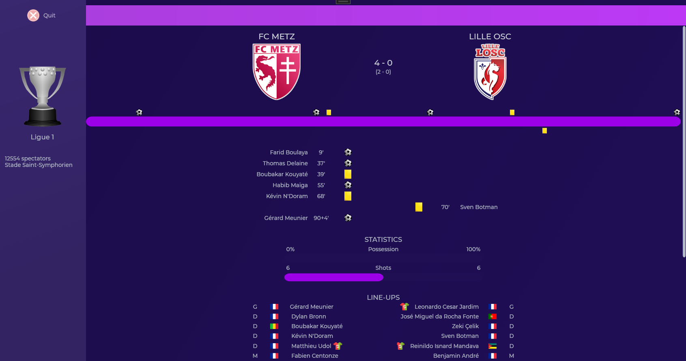 

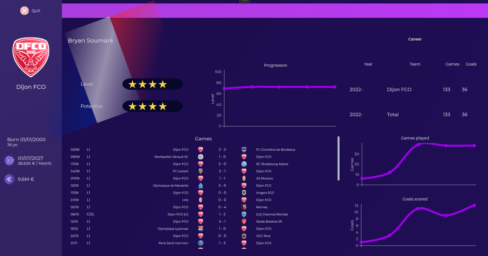 

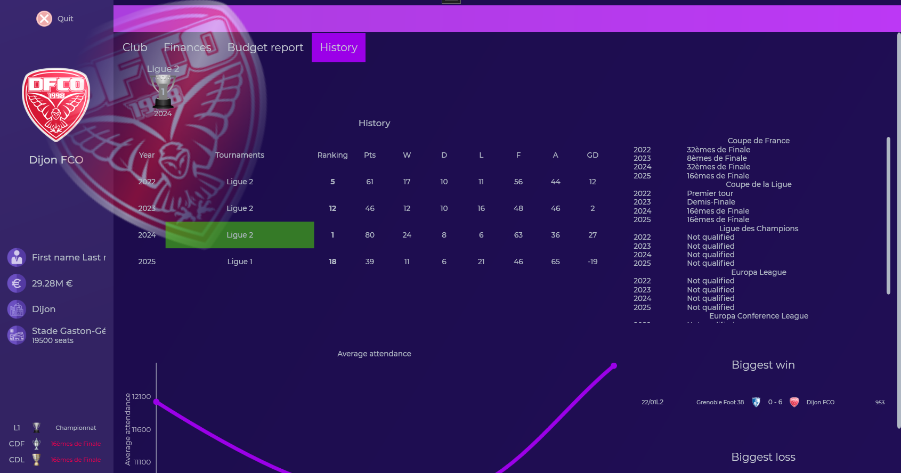

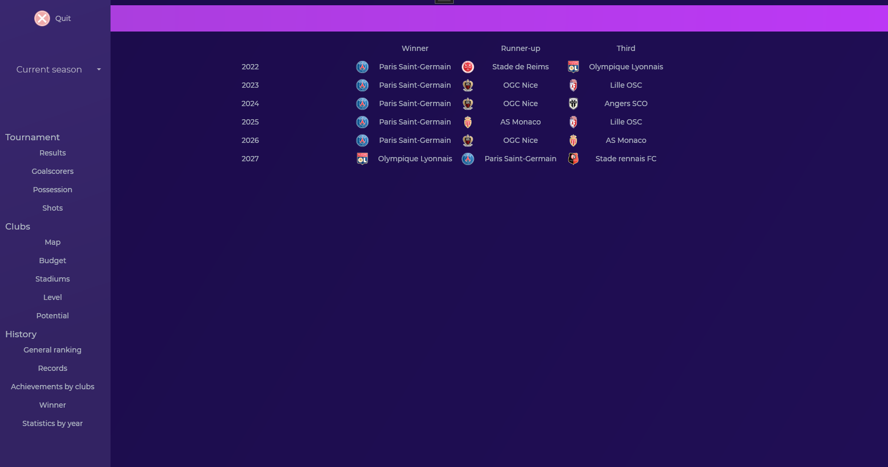

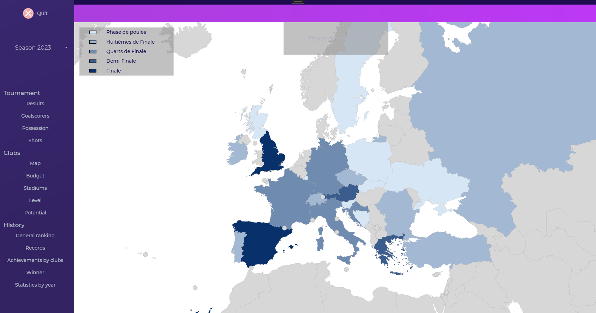

	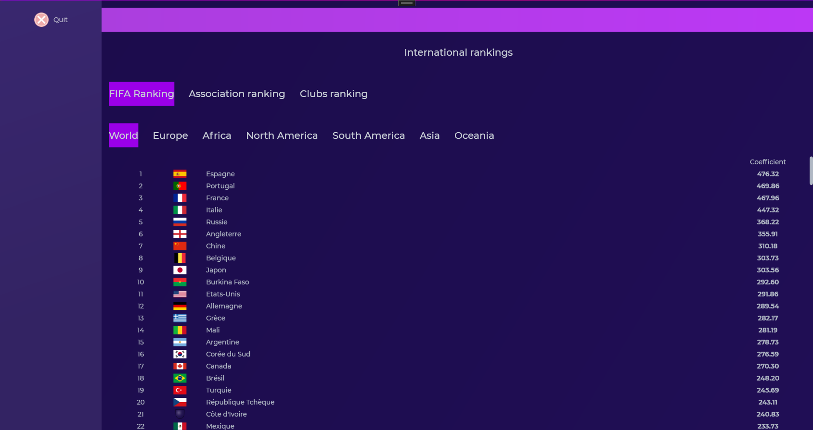
	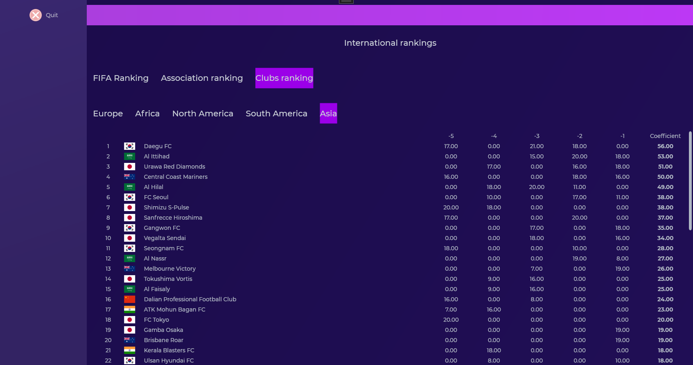

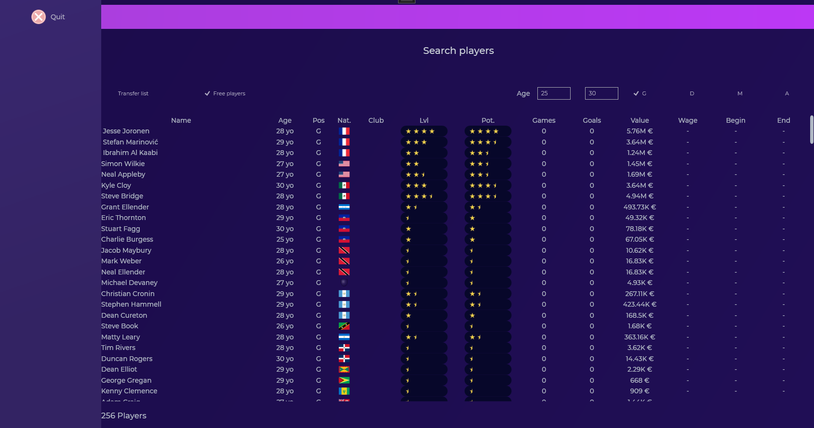

## Simulation stability

The simulation has gained in stability : money in simulation stabilizes after few years and remains stable after. Players and clubs average level tends to incrase over time.

Some realism issues : Small clubs at beginning can't stabilize at professionnal level.

  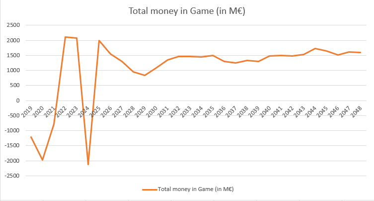
  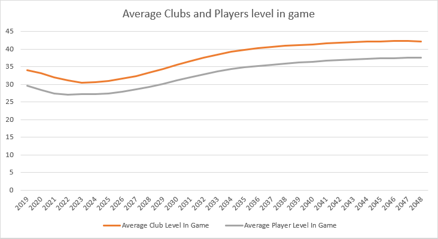

  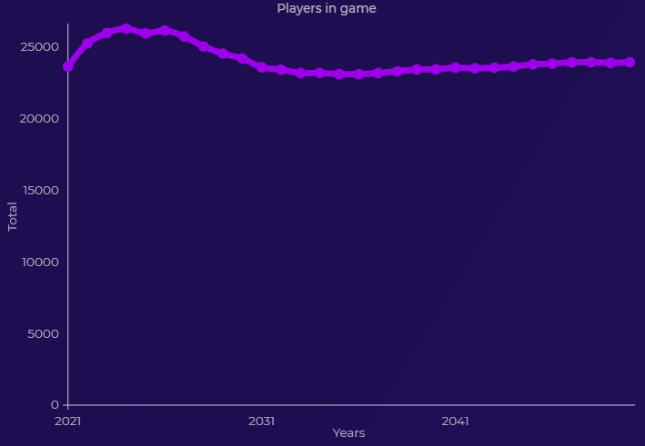
  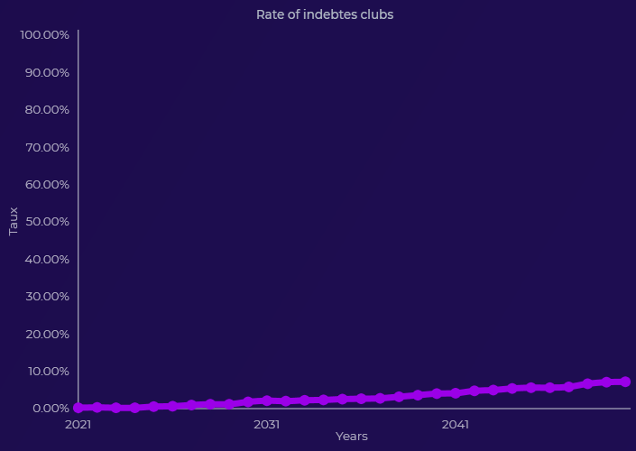

## Features

| Task                                      | Status         |
| ----------------------------------------- | -------------- |
| **Tournaments**                           |                |
| Association system                        | 🟢 OK          |
| Competition schedule                      | 🟢 OK          |
| **Club**                                  |                |
| Transfer system                           | 🟡 Partial     |
| Players progression                       | 🟡 Partial     |
| Club life (management, staff, facilities) | 🟡 Partial     |
| Financial control                         | 🔴 Not started |
| **Games**                                 |                |
| Detailed game engine                      | 🔴 Not started |
| **Miscellaneous**                         |                |
| Persistent data                           | 🟠 Deprecated  |
| Real-time                                 | 🔴 Not started |

## Tools and extensions

*   Visual Studio
*   .NET 6.0
*	Microsoft.Extensions.Logging.Debug
*   WPF
*   [Live Charts for WPF](https://v0.lvcharts.com/)
*   Mapsui
*   Windows Media Player library
*   MathNet.Numerics

## Links

*   [flaticon.com (iconnut, Freepik, kerismaker and Futuer)](https://www.flaticon.com)

## License

This project is licensed under the MIT License - see the [LICENSE.md](LICENSE.md) file for details

Map is licensed under the [Open Government Licence](https://www.nationalarchives.gov.uk/doc/open-government-licence/version/3/) ([World Administrative Boundaries - Countries and Territories](https://public.opendatasoft.com/explore/dataset/world-administrative-boundaries/information/?flg=fr-fr&dataChart=eyJxdWVyaWVzIjpbeyJjb25maWciOnsiZGF0YXNldCI6IndvcmxkLWFkbWluaXN0cmF0aXZlLWJvdW5kYXJpZXMiLCJvcHRpb25zIjp7ImZsZyI6ImZyLWZyIn19LCJjaGFydHMiOlt7ImFsaWduTW9udGgiOnRydWUsInR5cGUiOiJjb2x1bW4iLCJmdW5jIjoiQ09VTlQiLCJzY2llbnRpZmljRGlzcGxheSI6dHJ1ZSwiY29sb3IiOiIjRkY1MTVBIn1dLCJ4QXhpcyI6InN0YXR1cyIsIm1heHBvaW50cyI6NTAsInNvcnQiOiIifV0sInRpbWVzY2FsZSI6IiIsImRpc3BsYXlMZWdlbmQiOnRydWUsImFsaWduTW9udGgiOnRydWV9&location=7,14.42936,-56.20056&basemap=jawg.light))