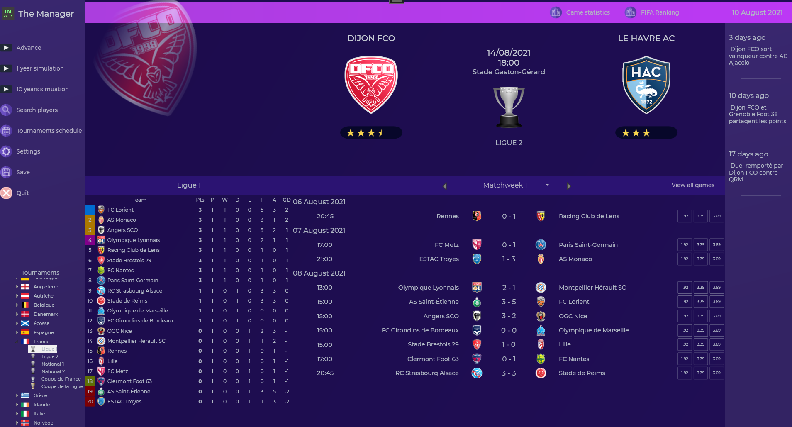
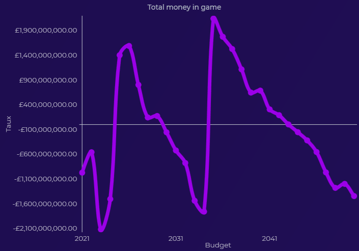

The Manager is a soccer simulator aiming to simulate tournaments, matchs, and clubs/players evolution, inspired by games such as Football Manager, FIFA Manager.

## Screenshots

 

 

 

 

	
	

## Simulation stability

The simulation has gained in stability : money in simulation stabilizes after few years and remains stable after. Players and clubs average level tends to incrase over time.

Some realism issues : Small clubs at beginning can't stabilize at professionnal level.

  
  

  
  

## Features

| Task                                                                  | Status           |
| --------------------------------------------------------------------- | ---------------- |
| **Simulation**                                                             |                  |
| Tournaments rules                                                     | 🟢 OK           |
| Game stability                                                        | 🟡 In progress  |
| Transferts                                                            | 🟡 In progress  |
| Detailed game engine                                                  | 🔴 Not started  |
| **Tournaments**                                                       |                 |
| Hierarchical Competitions (promotion, relegation ...)                 | 🟢 OK  |
| Automatically created domestic cup (qualifications and scheduling)    | 🟢 OK  |
| International tournaments                                 			| 🟢 OK  |
| International ranking                                 				| 🟢 OK  |
| Special rules                                                         | 🟢 OK  |
| **Club**                                                              |                 |
| Players progression                                                   | 🟡 In progress  |
| Managers and staff                                                    | 🟡 In progress |
| Evolution of club facilities                                          | 🟡 In progress |
| Financial control                                                     | 🔴 Not started |
| **Managing**                                                          |                 |
| Staff management                                                      | 🔴 Not started |
| Youth team management                                                 | 🔴 Not started |
| Recruitment tasks                                                     | 🟡 In progress |
| **UI**                                                              |                 |
| Games in real-time                                                    | 🟡 In progress  |
| **Miscellaneous**                                                     |				  |
| SQL                   				                                | 🟡 In progress |
| Manage memory for long simulations                                    | 🟡 In progress |

## Tools and extensions

*   Visual Studio
*   .NET 6.0
*	Microsoft.Extensions.Logging.Debug
*   WPF
*   [Live Charts for WPF](https://v0.lvcharts.com/)
*   Mapsui
*   Windows Media Player library
*   MathNet.Numerics

## Data

*   Cities : [SimpleMaps](https://simplemaps.com/data/world-cities)
*   Players and clubs : [Kaggle](https://www.kaggle.com/stefanoleone992/fifa-22-complete-player-dataset?select=players_22.csv)
*   [flaticon.com (iconnut, Freepik, kerismaker and Futuer)](https://www.flaticon.com)

## License

This project is licensed under the MIT License - see the [LICENSE.md](LICENSE.md) file for details

Map is licensed under the [Open Government Licence](https://www.nationalarchives.gov.uk/doc/open-government-licence/version/3/) ([World Administrative Boundaries - Countries and Territories](https://public.opendatasoft.com/explore/dataset/world-administrative-boundaries/information/?flg=fr-fr&dataChart=eyJxdWVyaWVzIjpbeyJjb25maWciOnsiZGF0YXNldCI6IndvcmxkLWFkbWluaXN0cmF0aXZlLWJvdW5kYXJpZXMiLCJvcHRpb25zIjp7ImZsZyI6ImZyLWZyIn19LCJjaGFydHMiOlt7ImFsaWduTW9udGgiOnRydWUsInR5cGUiOiJjb2x1bW4iLCJmdW5jIjoiQ09VTlQiLCJzY2llbnRpZmljRGlzcGxheSI6dHJ1ZSwiY29sb3IiOiIjRkY1MTVBIn1dLCJ4QXhpcyI6InN0YXR1cyIsIm1heHBvaW50cyI6NTAsInNvcnQiOiIifV0sInRpbWVzY2FsZSI6IiIsImRpc3BsYXlMZWdlbmQiOnRydWUsImFsaWduTW9udGgiOnRydWV9&location=7,14.42936,-56.20056&basemap=jawg.light))