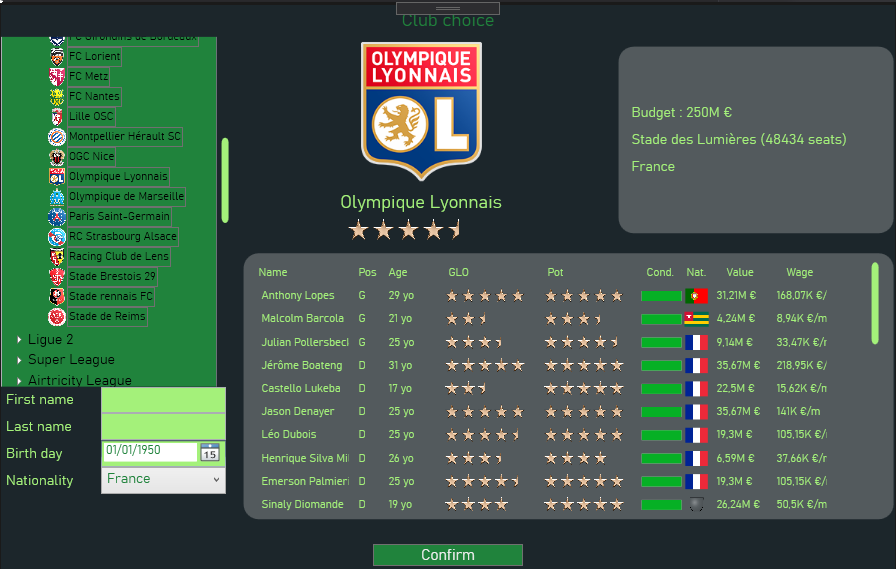
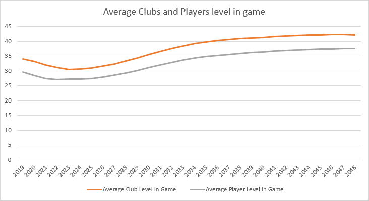
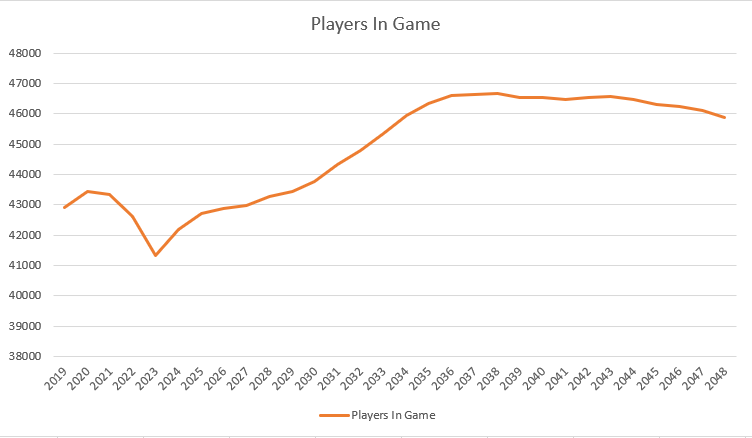

The Manager is a soccer simulator aiming to simulate tournaments, matchs, and clubs/players evolution, inspired by games such as Football Manager, FIFA Manager.

## Screenshots

### Menu

### Simulation configuration

  

### Tournaments screen

 

### Screens

	 
	

 

### Search players screen

### Pre-match screen

### Live match screen

## Simulation stability

The simulation has gained in stability : money in game stabilizes after few years and remains stable after. Players and clubs average level tends to incrase over time.

Some realism issues : Small clubs at beginning can't stabilize in professionnals divisions

  
  

  
  

## Features implemented

| Environment                                                               | 
| ------------------------------------------------------------------------- |
| Simulation on multiple years                                              |
| Managers                                                                  |
| Medias                                                                    |
| Free players transfers                                                    |

| Games                                                                     | 
| ------------------------------------------------------------------------- |
| Match simulation (goals, possession, substitutions)                       |
| Follow games in real-time (ranking, live results)                         |

| Players                                                                   | 
| ------------------------------------------------------------------------- |
| Players generation                                                        |
| Players evolution                                                         |

| Clubs                                                                     | 
| ------------------------------------------------------------------------- |
| Evolution of club training facilities                                     |
| Reserves teams                                                            |
| Can be forbidden to recruit if their finances are bad                     |

| Tournaments                                                               | 
| ------------------------------------------------------------------------- |
| Hierarchical Competitions (promotion, relegation ...)                     |
| Domestic Cup                                                              |
| International tournaments                                                 |
| International ranking                                                     |
| Specials rules (lower team at home for domestic cups...)                  |
| Reserves teams can't go too high in league structure                      |

| Database                                                                  | 
| ------------------------------------------------------------------------- |
| Savegame                                                                  |
| XML Database                                                              |
| HTML exportation                                                          |

| GUI                                                                       | 
| ------------------------------------------------------------------------- |
| Sample GUI                                                                | 
| Custom themes                                                             |

## Features to implement and issues to fix

| Task                                                                  | Status           |
| --------------------------------------------------------------------- | ---------------- |
| **Stability**                                                         |                  |
| Improve world stability                                               | 🟡 In progress |
| **Managing**                                                          |                 |
| Staff management                                                      | 🔴 Not started |
| Youth team management                                                 | 🔴 Not started |
| Search / observe players                                              | 🟡 In progress |
| Negociate contracts / transferts with other clubs                     | 🔴 Not started |
| **Environment**                                                       |                 |
| A system for transferring players between clubs                       | 🟡 In progress |
| National Directorate of Management Control (DNCG)                     | 🟡 In progress |
| **GUI**                                                               |                 |
| View system                                                           | 🟡 In progress |
| Make player search table faster                                       | 🟡 In progress |
| Improve GUI                                                           | 🟡 In progress |
| **Miscellaneous**                                                     |				  |
| Implement Machine Learning solution for transferts management         | 🔴 Not started |
| Pre-game competitions selection                                       | 🟡 In progress |
| Try to reduce savegame size (135mo / year)                            | 🟡 In progress |
| Manage memory for long games                                          | 🔴 Not started |

## Next Features

| Task                                                                  | Status           |
| --------------------------------------------------------------------- | ---------------- |
|  Data editor                                                          | 🔴 Not started |
|  Generate Wiki with simulation data                                   | 🔴 Not started |
|  3D Engine for games                                                  | 🔴 Not started |

## Authors
Nicolas Lépy

## Tools used
*   Visual Studio
*   WPF
*   Windows Media Player library
*   MapWindow GIS

## Credits

*   [Live Charts for WPF](https://www.google.com)
*   [MapWindow GIS](https://www.mapwindow.org/)
*   MathNet.Numerics
*   [pngtree.com](https://pngtree.com)
*   Data about cities were obtained from [SimpleMaps](https://simplemaps.com/data/world-cities)
*   Data about players were obtained from [Kaggle](https://www.kaggle.com/stefanoleone992/fifa-20-complete-player-dataset?select=players_20.csv)

## License

This project is licensed under the MIT License - see the [LICENSE.md](LICENSE.md) file for details
